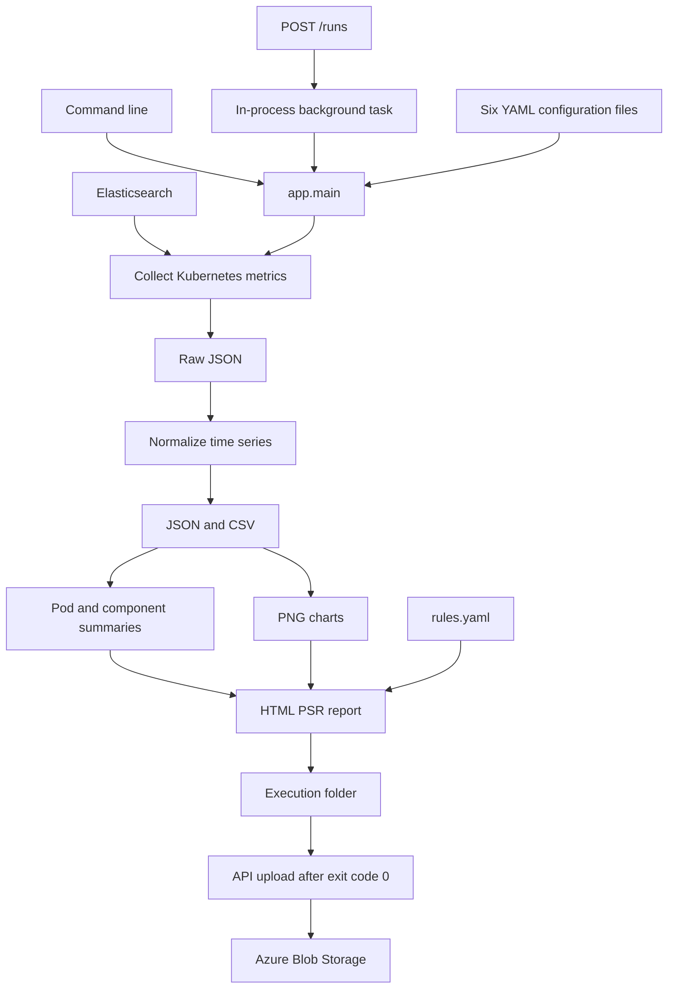

# Approaches and Architecture

Describe the pipeline, integration boundaries, source modules, and design tradeoffs.

[Project README](../README.md) | [Documentation Index](INDEX.md)

**Last updated:** 7 September 2026 | **Basis:** inspected PerfAgent working tree; historical deployment evidence is dated separately.

## Table of Contents

- [Pipeline overview](#pipeline-overview)
- [Design choices and practical implications](#design-choices-and-practical-implications)
- [Storage boundaries](#storage-boundaries)
- [Source map](#source-map)
- [Next steps](#next-steps)

## Pipeline overview

`app/main.py` performs collection directly, then starts each processing module with the same Python interpreter. It passes the execution ID and entity to every downstream stage. A nonzero stage exit stops orchestration.

Collection processes enabled components sequentially. It records component successes and failures and can continue collecting other components after a handled component failure. If any components failed, collection ultimately raises an error, so the complete pipeline does not continue as a successful run.

The execution ID groups all artifacts. The API creates IDs using the entity, UTC timestamp, and an eight-character UUID suffix. The command line can also accept a custom execution ID.

## Design choices and practical implications

| Choice | Purpose | Current implication |
| --- | --- | --- |
| Elasticsearch aggregation queries | Collect useful bucketed utilization without retrieving every source document. | Query group limits and bucket sizes affect coverage and detail. |
| Entity/component separation | Reuse service configuration across business flows. | Entity names select membership; they do not change metric semantics. |
| Raw and normalized outputs | Preserve source evidence and provide reusable analysis tables. | Reprocessing needs consistent configuration and artifact identity. |
| Subprocess stages | Reuse independently callable processing modules. | A failing stage stops orchestration; partial files can remain. |
| Deterministic threshold rules | Make numeric acceptance checks inspectable. | Business acceptance values must be confirmed; LLM analysis is separate future work. |
| Local temporary output then Blob upload | Allow ordinary file writers and publish complete generated folders. | Publication currently lacks persisted status and a completion manifest. |
| In-process API background tasks | Connect HTTP requests to the existing CLI. | Accepted work is not durable across restarts. |

## Storage boundaries

Git holds source and documentation. Container Registry holds built images. Classic File Share is the intended external configuration source. The pipeline writes local runtime artifacts, then the API uploads them to Azure Blob Storage.

File Share mounting and Blob upload are different integrations. `PERF_CONFIG_DIR` still needs to be honored consistently by pipeline configuration loading; see [Stratosphere Deployment](stratosphere/02-STRATOSPHERE-DEPLOYMENT.md).

## Source map

| Area | Main source files |
| --- | --- |
| Orchestration | `app/main.py` |
| API and publication | `app/api.py`, `app/blob_uploader.py` |
| Configuration and registration | `app/config_loader.py`, `app/registry.py`, `config/*.yaml` |
| Elasticsearch transport | `app/elastic_client.py` |
| Query and collection | `app/query_builders/kubernetes_query.py`, `app/result_collector/main.py`, `app/result_collector/kubernetes_collector.py` |
| Raw input and output writers | `app/readers/raw_reader.py`, `app/writers/json_writer.py`, `app/writers/csv_writer.py` |
| Normalization and statistics | `app/result_aggregator/main.py`, `normalizer.py`, `summary_main.py`, `summary_builder.py`, `statistics.py` in that package |
| Charts | `app/visualization/chart_main.py`, `app/visualization/chart_builder.py` |
| HTML and rules | `app/reporting/html_report_main.py`, `app/reporting/html_report_builder.py`, `app/rule_analyzer/analyzer.py` |
| MCP | `app/mcp_server.py` |
| Packaging and tests | `deploy/docker/Dockerfile`, `.dockerignore`, `requirements.txt`, `tests/test_blob_uploader.py` |

Update this document when the configuration path, API lifecycle, output contract, or deployment/storage integration changes. Keep historical deployment evidence dated and separate from current source verification.

## Next steps

- [Results Processing](06-RESULTS-PROCESSING.md) follows the generated data.
- [API Reference](11-API-REFERENCE.md) describes submission and lifecycle limits.
- [Contributing](12-CONTRIBUTING.md) describes extension points.

---

[Project README](../README.md) | [Documentation Index](INDEX.md)
